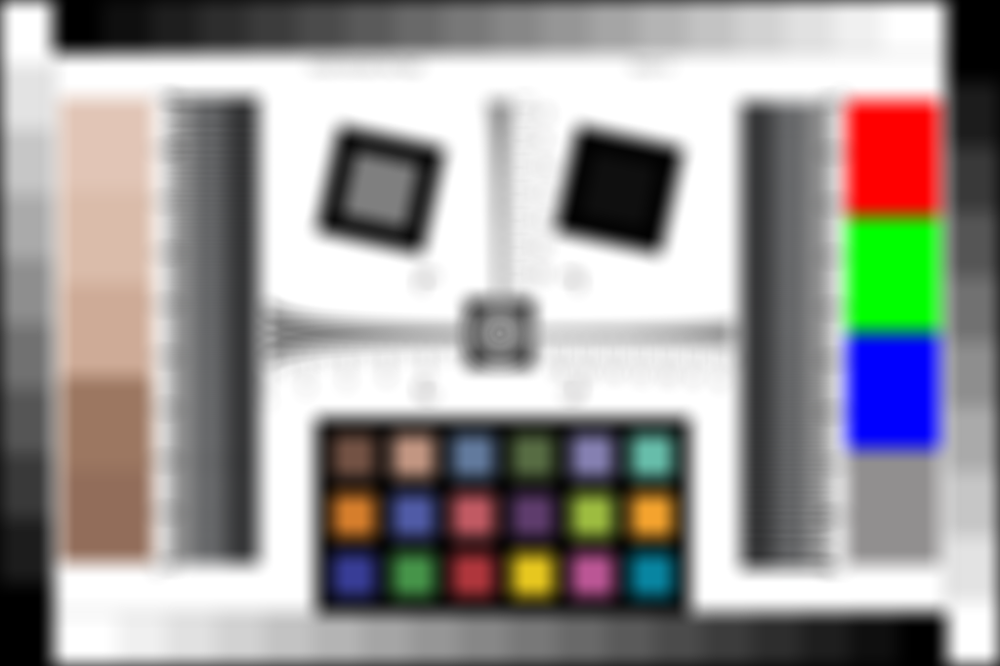

# Hello DefocusLens

**Script:** [`0_hello_defocuslens.py`](https://github.com/vccimaging/DeepLens/blob/main/0_hello_defocuslens.py)

A lightweight thin-lens defocus (circle-of-confusion) model for depth-of-field
and bokeh simulation — no ray tracing or wave optics required.

## What it demonstrates

- Constructing a `DefocusLens` from focal length and F-number, then focusing it with `refocus()`.
- Computing the defocus (pillbox) PSF for an out-of-focus point.
- Rendering a scene with depth-dependent blur via `render_rgbd()`.

## Run

```bash
python 0_hello_defocuslens.py
```

## Key code

```python
from deeplens import DefocusLens

# A 50 mm f/1.8 lens on a 20 x 20 mm sensor, focused at 1 m (depths are negative).
lens = DefocusLens(foclen=50.0, fnum=1.8, sensor_size=(20.0, 20.0), sensor_res=(64, 64))
lens.refocus(-1000.0)

# Circle of confusion / depth of field across a range of depths
coc = lens.coc(depths)
dof = lens.dof(depths)

# Defocus (pillbox) PSF for an out-of-focus on-axis point
psf = lens.psf(points=[[0.0, 0.0, -500.0]], ks=31, psf_type="pillbox")

# Render a chart at a uniform out-of-focus depth (depth_map in mm, positive)
img_render = lens.render_rgbd(img, depth_map, psf_ks=128)
```

## Results

| Defocus PSF | Rendered (with blur) |
|---|---|
|  |  |

## See also

- API: [`DefocusLens`](../api/defocuslens.md)
