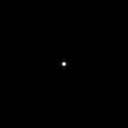
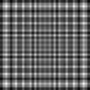
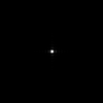

# Hello DiffractiveLens

**Script:** [`0_hello_diffraclens.py`](https://github.com/vccimaging/DeepLens/blob/main/0_hello_diffraclens.py)

A pure wave-optics lens built from a diffractive phase plate. The complex
wavefront is propagated to the sensor with the band-limited Angular Spectrum
Method (ASM).

## What it demonstrates

- Loading a `DiffractiveLens` from JSON (here a Fresnel phase plate).
- Computing the PSF for an object at infinity, at finite depth, and off-axis.
- Wave-optics image rendering through the diffractive lens.

## Run

```bash
python 0_hello_diffraclens.py
```

## Key code

```python
from deeplens import DiffractiveLens
from deeplens.imgsim import conv_psf

lens = DiffractiveLens(filename="./datasets/lenses/diffraclens/fresnel.json")

psf_inf  = lens.psf(points=[0.0, 0.0, float("-inf")], wvln=0.55, ks=128)  # collimated, on-axis
psf_near = lens.psf(points=[0.0, 0.0, -500.0], wvln=0.55, ks=128)         # finite depth
psf_off  = lens.psf(points=[0.7, 0.0, float("-inf")], wvln=0.55, ks=128)  # off-axis (field x = 0.7)

# Image simulation: convolve a chart with the (infinity) PSF replicated to RGB
psf_rgb = lens.psf(points=[0.0, 0.0, float("-inf")], wvln=0.55, ks=64)[None].repeat(3, 1, 1)
img_render = conv_psf(img, psf_rgb)
```

## Results

| PSF (object at ∞) | PSF (near) | PSF (off-axis) |
|---|---|---|
|  |  |  |

### Rendered image


!!! note
    The Fresnel plate is sampled at 2 µm so the quadratic phase is well-sampled
    (`ps < λ·f/D`) and forms a clean, diffraction-limited focus. Coarser pixel
    pitches undersample the phase and produce ghost-lattice PSFs; see
    [DiffractiveLens design](design_diffraclens.md) for the sampling rule.

## See also

- API: [`DiffractiveLens`](../api/diffraclens.md), [`ComplexWave`](../api/core.md#light)
