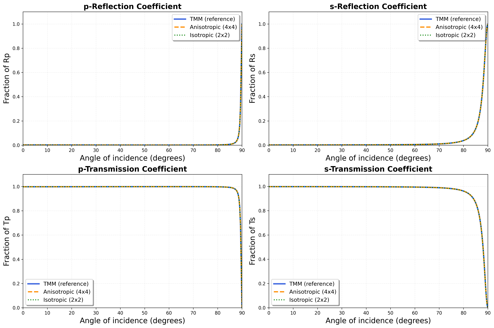
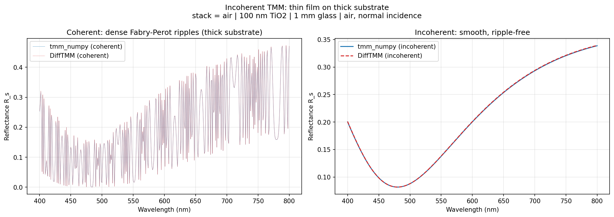
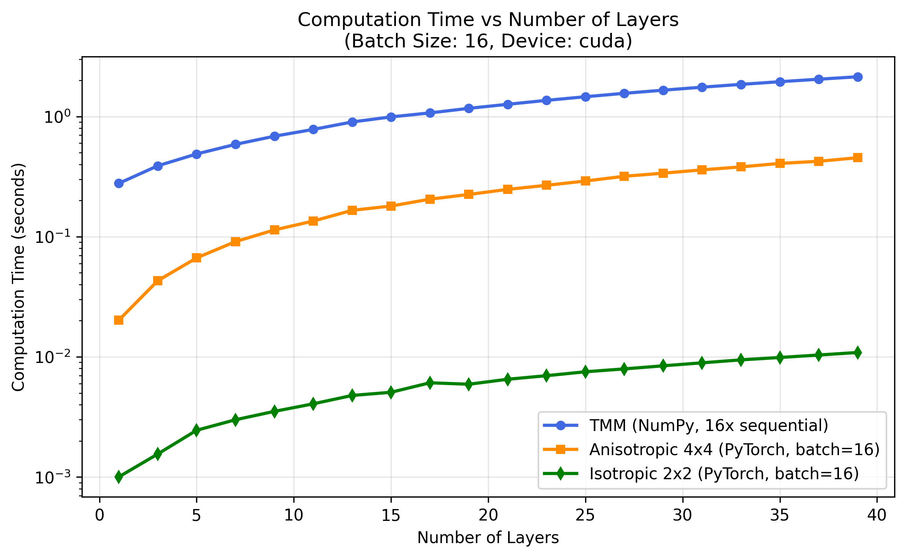
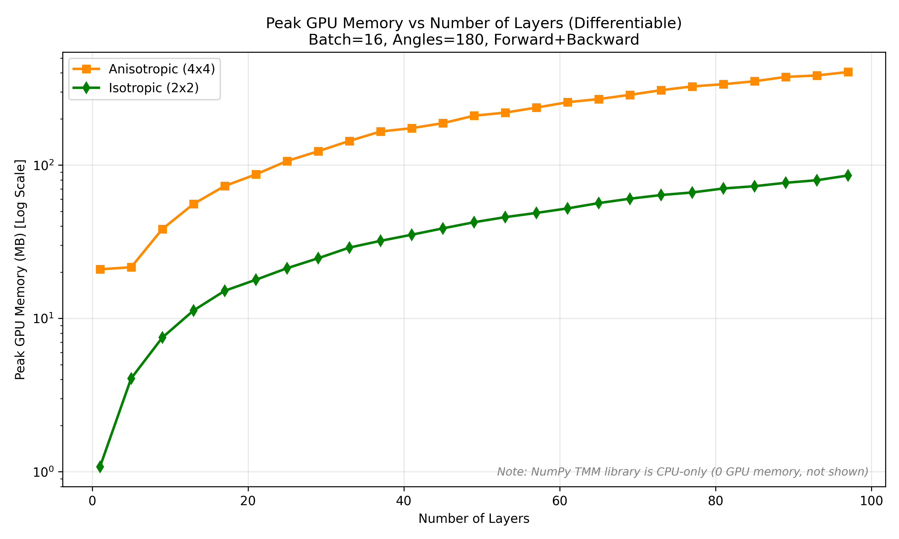

# Benchmarks

DiffTMM is validated for **accuracy** against the reference NumPy TMM library
([sbyrnes321/tmm](https://github.com/sbyrnes321/tmm), bundled as `tmm_numpy/`) and
benchmarked for **performance** (speed and GPU memory) against it. The scripts
live in the repository's `benchmarks/` directory and each one regenerates the
figures below.

```bash
# from the repo root, with the benchmark extras installed
pip install -e ".[benchmarks]"

python benchmarks/1_compare_angle_response_isotropic.py     # isotropic / SPR accuracy
python benchmarks/1_compare_angle_response_anisotropic.py   # anisotropic 4x4 accuracy
python benchmarks/2_compare_speed.py                        # speed vs NumPy TMM
python benchmarks/3_compare_memory.py                       # GPU memory (2x2 vs 4x4)
python benchmarks/4_compare_incoherent.py                   # incoherent accuracy
```

---

## Accuracy

### Isotropic & anisotropic vs. reference TMM

The Kretschmann surface-plasmon-resonance (SPR) configuration — a thin silver film
that produces a sharp angular reflection dip — is a demanding test case. DiffTMM's
2×2 isotropic and 4×4 anisotropic solvers both reproduce the reference NumPy TMM
coefficients (`Rp`, `Rs`, `Tp`, `Ts`) across the full angle range, with a maximum
error below `1e-4`:



### Anisotropic 4×4 validation

The general 4×4 solver is checked against analytical Fresnel equations in the
isotropic limit (error ~`1e-7`–`1e-5`), and for the physical properties expected
of a birefringent stack — energy conservation, cross-polarization coupling
(`s→p`, `p→s`), and reciprocity:


### Incoherent solver validation

For a thin film on a thick (1 mm) substrate, the
[`IncoherentIsotropicFilmSolver`](../api/incoherent.md) matches `tmm_numpy`'s
incoherent calculation — both the dense coherent Fabry–Perot ripples and the
smooth incoherent result agree:



---

## Performance

### Speed

Because DiffTMM is vectorized, it evaluates a whole batch of film stacks in
parallel, while the NumPy reference processes them sequentially. At batch size 16,
across stacks of 1–39 layers (100 angles, 633 nm), DiffTMM is roughly **two orders
of magnitude faster**:



| Layers | TMM NumPy (s) | Anisotropic 4×4 (s) | Isotropic 2×2 (s) | Speedup (4×4) | Speedup (2×2) |
|---|---|---|---|---|---|
| 3  | 0.281 | 0.003 | 0.001 | 84× | 233× |
| 11 | 0.577 | 0.005 | 0.003 | 128× | 201× |
| 25 | 1.076 | 0.008 | 0.006 | 134× | 186× |
| 39 | 1.574 | 0.010 | 0.009 | 165× | 182× |

*Measured at batch size 16 on an NVIDIA RTX 5090. The fast 2×2 isotropic solver
reaches ~190× and the general 4×4 anisotropic solver ~134×.*

### GPU memory

For a differentiable training step (forward + backward), the 2×2 isotropic solver
uses far less GPU memory than the general 4×4 solver — roughly **23× less** —
making it the better choice whenever every layer is isotropic. (The NumPy TMM
reference is CPU-only, so it uses no GPU memory.)



---

These results explain DiffTMM's solver guidance: reach for the
[isotropic 2×2 solver](../api/isotropic.md) by default for its speed and low
memory, and use the [anisotropic 4×4 solver](../api/anisotropic.md) only when a
layer is genuinely birefringent.
