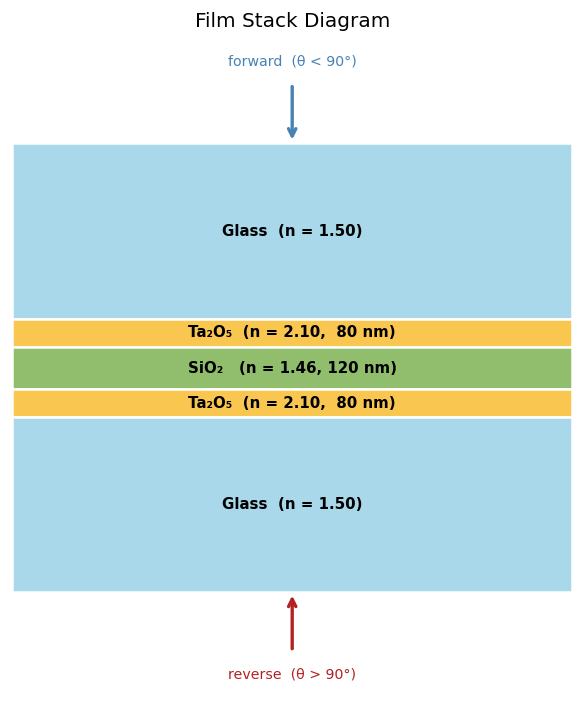
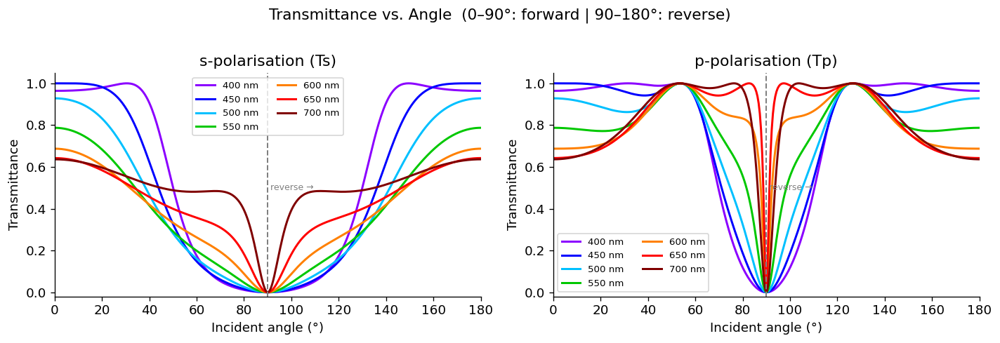
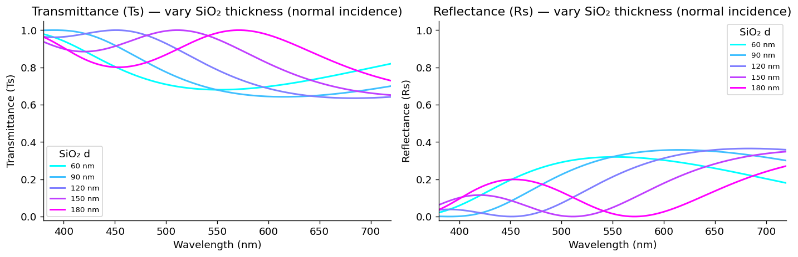
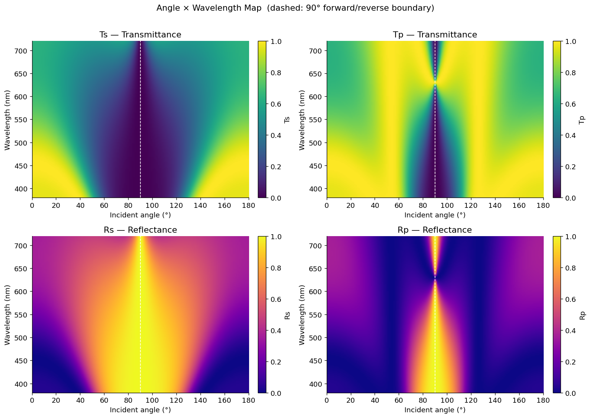

# Forward Simulation

Compute the Fresnel coefficients of a multi-layer film stack as a function of
incident angle and wavelength, using the fast 2×2
[`IsotropicFilmSolver`](../api/isotropic.md).

**Notebook:** `1_forward_simu.ipynb`

**Film stack:** Glass | Ta₂O₅ (80 nm) | SiO₂ (120 nm) | Ta₂O₅ (80 nm) | Glass

## Define the film stack

A solver is constructed from the incident medium, the interior layer indices, the
exit medium, and the layer thicknesses (in μm):

```python
import torch
from difftmm import IsotropicFilmSolver

device = torch.device("cuda" if torch.cuda.is_available() else "cpu")

n_in          = 1.50
n_out         = 1.50
n_layers_list = [2.10, 1.46, 2.10]      # Ta2O5 | SiO2 | Ta2O5
d_target      = [0.080, 0.120, 0.080]   # thicknesses in um

wvlns = [0.40, 0.45, 0.50, 0.55, 0.60, 0.65, 0.70]   # um

solver = IsotropicFilmSolver(
    mat_in=n_in,
    mat_out=n_out,
    mat_ls=n_layers_list,
    thickness_ls=d_target,
    batch_size=1,
    device=device,
)
```



## Sweep angle at multiple wavelengths

`simulate()` accepts a 1-D tensor of angles (radians) and a list of wavelengths
(μm). The angle range `0 → π` covers both forward (`0–90°`) and reverse
(`90–180°`) propagation through the stack:

```python
angles = torch.linspace(0.0, torch.pi, 360, device=device)
ts, tp, rs, rp = solver.simulate(theta=angles, wvln=wvlns)
# Each coefficient: shape (batch_size=1, n_wvlns=7, n_angles=360), complex

# Power coefficients (transmittance / reflectance)
Ts = (ts[0].abs() ** 2)   # (n_wvlns, n_angles)
Tp = (tp[0].abs() ** 2)
Rs = (rs[0].abs() ** 2)
Rp = (rp[0].abs() ** 2)
```

The coefficients are complex amplitudes — take `|·|²` for power. `ts`/`rs` are the
s-polarization (TE) amplitudes; `tp`/`rp` are p-polarization (TM).



## Check energy conservation

For a lossless stack, transmittance + reflectance should sum to 1 at every angle
and wavelength — a useful correctness check:

```python
max_err_s = (Ts + Rs - 1).abs().max()
max_err_p = (Tp + Rp - 1).abs().max()
print(f"Max |T+R-1|  s-pol: {max_err_s:.2e}   p-pol: {max_err_p:.2e}")
```

## Sweep wavelength at fixed angles

The same call shape works for a wavelength sweep at a few fixed angles — useful
for plotting the coating's spectral response:

```python
import numpy as np

wvlns_sweep = torch.linspace(0.38, 0.72, 300).tolist()              # um
fixed_angles = torch.tensor([np.deg2rad(a) for a in (0, 20, 40, 60)], device=device)

ts_w, tp_w, rs_w, rp_w = solver.simulate(theta=fixed_angles, wvln=wvlns_sweep)
# shape (1, 300, 4)
```

## Vary a layer thickness

Building a fresh solver per thickness shows how the spectral response shifts as
the middle SiO₂ layer changes — the core intuition behind thin-film design:

```python
for d_sio2 in [0.06, 0.09, 0.12, 0.15, 0.18]:    # SiO2 thickness in um
    s = IsotropicFilmSolver(
        mat_in=n_in, mat_out=n_out,
        mat_ls=n_layers_list,
        thickness_ls=[0.080, d_sio2, 0.080],
        device=device,
    )
    ts_t, _, rs_t, _ = s.simulate(theta=torch.tensor([0.0], device=device), wvln=wvlns_sweep)
    Ts_t = (ts_t[0, :, 0].abs() ** 2)   # transmittance at normal incidence
```



## Angle × wavelength map

Sweeping both angle and wavelength together gives a full 2-D picture of the
coating's response. The dashed line marks the 90° forward/reverse boundary:



The notebook also plots the phase of the Fresnel coefficients. See
`1_forward_simu.ipynb` for the full set of figures.
