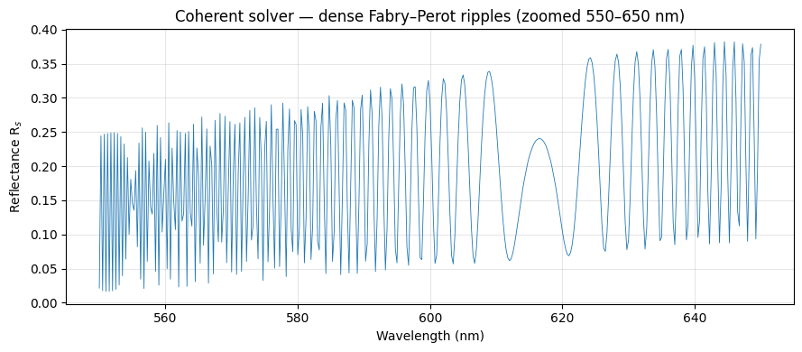
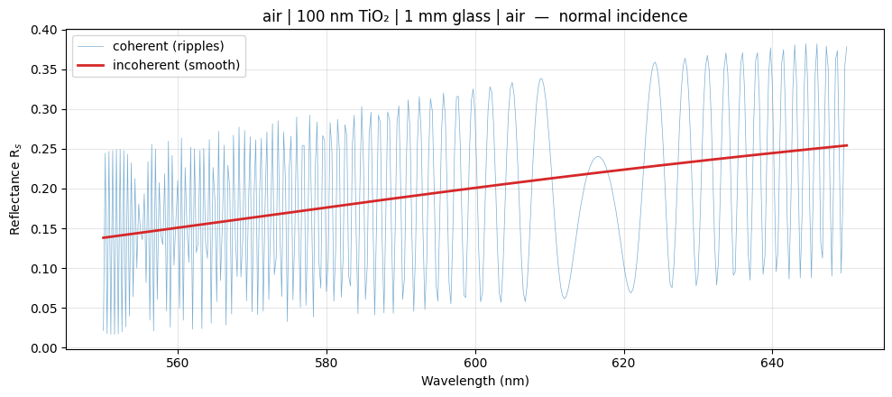
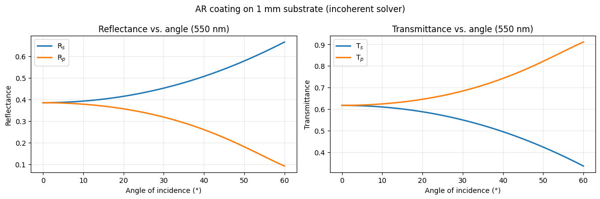
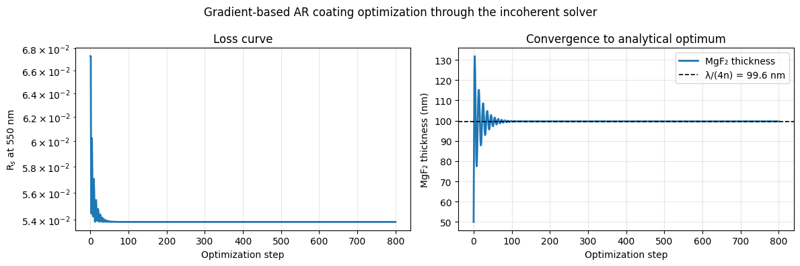

# Incoherent Films

Model film stacks that include a **thick substrate** — like a 1 mm glass slide —
without the unphysical interference ripples a fully-coherent solver would produce.
The [`IncoherentIsotropicFilmSolver`](../api/incoherent.md) marks each interior
layer coherent (`'c'`) or incoherent (`'i'`) and returns real power coefficients.

**Notebook:** `4_incoherent_film.ipynb`

## The problem: Fabry–Perot ripples

Sweeping wavelength through a 100 nm TiO₂ film on a 1 mm glass slab with the
coherent solver resolves the substrate's phase, producing dense ripples far finer
than any spectrometer can measure:

```python
import numpy as np
import torch
from difftmm import IsotropicFilmSolver, IncoherentIsotropicFilmSolver

device = torch.device("cuda" if torch.cuda.is_available() else "cpu")

n_film = 2.40 + 0.001j     # TiO2 (small loss for numerical stability)
n_sub  = 1.52              # glass
wvln_um = (np.linspace(550, 650, 401) / 1000).tolist()
theta   = torch.tensor([0.0], device=device)

coh = IsotropicFilmSolver(
    mat_in=1.0, mat_out=1.0,
    mat_ls=[n_film, n_sub],
    thickness_ls=[0.100, 1000.0],   # 100 nm film | 1 mm substrate
    thickness_max=2000.0,           # allow the 1 mm substrate
    device=device,
)
_, _, rs_coh, _ = coh.simulate(theta=theta, wvln=wvln_um)
R_coh = (rs_coh[0, :, 0].abs() ** 2)   # dense ripples
```



## The fix: mark the substrate incoherent

`c_list` gives the coherence of each **interior** layer, in physical order. Keep
the 100 nm TiO₂ coherent and mark the 1 mm glass incoherent. The two semi-infinite
media are always incoherent. The solver returns real `(Rs, Rp, Ts, Tp)`:

```python
inc = IncoherentIsotropicFilmSolver(
    mat_in=1.0, mat_out=1.0,
    mat_ls=[n_film, n_sub],
    c_list=["c", "i"],              # TiO2 coherent, glass incoherent
    thickness_ls=[0.100, 1000.0],
    thickness_max=2000.0,
    device=device,
)
Rs, Rp, Ts, Tp = inc.simulate(theta=theta, wvln=wvln_um)
R_inc = Rs[0, :, 0]                  # smooth, measurable spectrum
```

The coherent curve oscillates wildly; the incoherent curve is smooth, and its
value tracks the slow envelope of the coherent ripples.



## Anti-reflection coating on a thick slide

A more practical stack: a two-layer TiO₂/SiO₂ AR coating (both coherent) on a 1 mm
N-BK7 substrate (incoherent), swept over angle at 550 nm. Both polarizations come
out smooth and measurable:



## Differentiable through thick substrates

The incoherent solver is still fully differentiable, so you can inverse-design a
coating that sits on a thick substrate. Here a single-layer MgF₂ anti-reflection
coating is optimized to minimize Rₛ at 550 nm — and converges to the analytical
quarter-wave optimum `d* = λ/(4·n_MgF₂) ≈ 99.6 nm`:

```python
opt = IncoherentIsotropicFilmSolver(
    mat_in=1.0, mat_out=1.0,
    mat_ls=[1.38, 1.515],            # MgF2 | glass
    c_list=["c", "i"],
    thickness_ls=[0.050, 1000.0],    # start MgF2 too thin (50 nm)
    thickness_max=2000.0,
    device=device,
)
opt.film_params = opt.film_params.detach().requires_grad_(True)

wvln  = torch.tensor([0.550], device=device)
theta = torch.tensor([0.0], device=device)
optimizer = torch.optim.Adam([opt.film_params], lr=2e-5)

for step in range(800):
    optimizer.zero_grad()
    Rs, _, _, _ = opt.simulate(theta=theta, wvln=wvln)
    loss = Rs[0, 0, 0]               # minimize reflectance
    loss.backward()
    opt.film_params.grad[..., -1] = 0   # freeze the substrate (no physical effect)
    optimizer.step()
```



See `4_incoherent_film.ipynb` for the full walkthrough.
