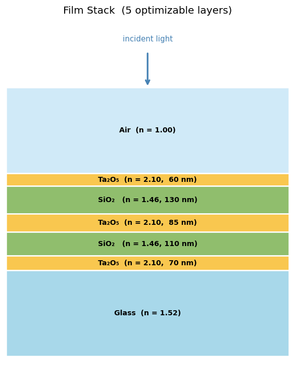
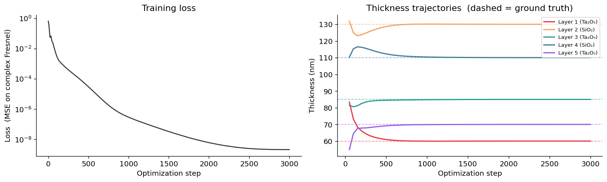
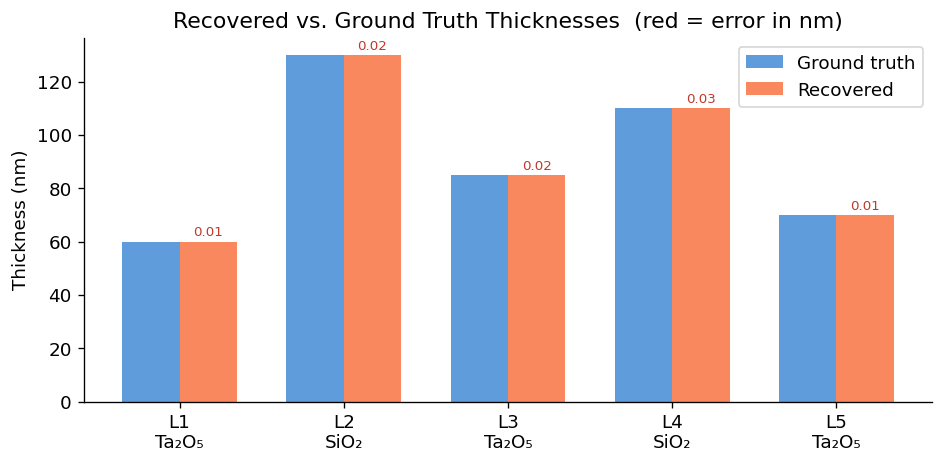
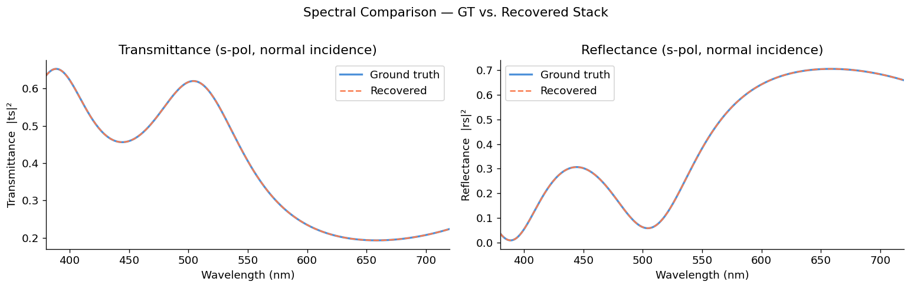

# Inverse Design

Recover unknown film thicknesses with **gradient-based optimization** through the
transfer matrix method. Because DiffTMM is differentiable end-to-end, you can
backpropagate from a target set of Fresnel coefficients all the way to the layer
thicknesses and optimize them with a standard PyTorch optimizer.

**Notebook:** `2_inverse_design.ipynb`

**Film stack:** Air | Ta₂O₅ | SiO₂ | Ta₂O₅ | SiO₂ | Ta₂O₅ | Glass (5 optimizable layers)

## Workflow

1. Define a *ground-truth* stack with known thicknesses and compute its target
   Fresnel coefficients over a batch of random `(wavelength, angle)` samples.
2. Initialize a new stack with *random* thicknesses and optimize them with Adam
   until its coefficients match the target.



## Forward TMM as a differentiable function

For inverse design, drive the stack through the functional API
[`create_jones_matrix_isotropic`](../api/isotropic.md#functional-api) so the
thicknesses can be an external optimizable tensor:

```python
import torch
from difftmm import create_jones_matrix_isotropic

device = torch.device("cuda" if torch.cuda.is_available() else "cpu")

n_in   = 1.00   # air
n_out  = 1.52   # glass substrate
n_list = torch.tensor([2.10, 1.46, 2.10, 1.46, 2.10], device=device)   # 5 layers
d_gt   = torch.tensor([0.060, 0.130, 0.085, 0.110, 0.070], device=device)  # ground truth (um)

def forward_tmm(n_list, d_list, n_in, n_out, inp):
    """inp: (B, 2) of [wvln_um, angle_rad] -> (B, 4) complex [ts, tp, rs, rp]."""
    B = inp.shape[0]
    wvlns, angles = inp[:, 0], inp[:, 1]
    n_layers_1d = n_list.unsqueeze(0).expand(B, -1).to(torch.complex64)
    d_1d        = d_list.unsqueeze(0).expand(B, -1)
    ts, tp, rs, rp = create_jones_matrix_isotropic(
        n_layers_1d, d_1d, wvlns.unsqueeze(1), n_in, n_out, angles.unsqueeze(1)
    )
    return torch.stack([ts[:, 0, 0], tp[:, 0, 0], rs[:, 0, 0], rp[:, 0, 0]], dim=-1)
```

## Generate the target data

Sample a batch of random wavelengths (400–700 nm) and angles (0–60°), and evaluate
the ground-truth stack to get the target coefficients:

```python
B = 1024
wavelengths = torch.empty(B, device=device).uniform_(0.40, 0.70)
angles      = torch.rand(B, device=device) * (torch.pi / 3)      # 0-60 deg
inp = torch.stack([wavelengths, angles], dim=-1)                 # (B, 2)

with torch.no_grad():
    target = forward_tmm(n_list, d_gt, n_in, n_out, inp)         # (B, 4) complex
```

## Optimization loop

Parameterize thickness through a sigmoid so it stays in physical bounds, then
minimize the MSE between predicted and target complex coefficients:

```python
d_min, d_max = 0.01, 0.20   # um

def param_to_thickness(p):
    return torch.sigmoid(p) * (d_max - d_min) + d_min

d_param   = torch.nn.Parameter(torch.randn(5, device=device) * 0.5)
optimizer = torch.optim.Adam([d_param], lr=0.02)
scheduler = torch.optim.lr_scheduler.CosineAnnealingLR(optimizer, T_max=3000)

for step in range(3000):
    optimizer.zero_grad()
    d_current = param_to_thickness(d_param)
    pred = forward_tmm(n_list, d_current, n_in, n_out, inp)
    diff = pred - target
    loss = (diff.real ** 2 + diff.imag ** 2).mean()
    loss.backward()
    optimizer.step()
    scheduler.step()
```



## Result

From a random initialization, the optimizer recovers all five thicknesses to
within a few hundredths of a nanometer of ground truth:



The notebook then rebuilds the recovered stack with
[`IsotropicFilmSolver`](../api/isotropic.md) and confirms its spectral response
matches the ground truth across the full visible band:



See `2_inverse_design.ipynb` for the full walkthrough.
