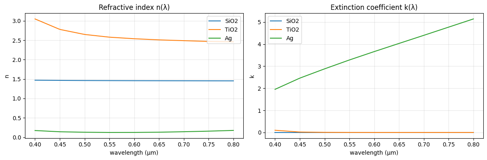
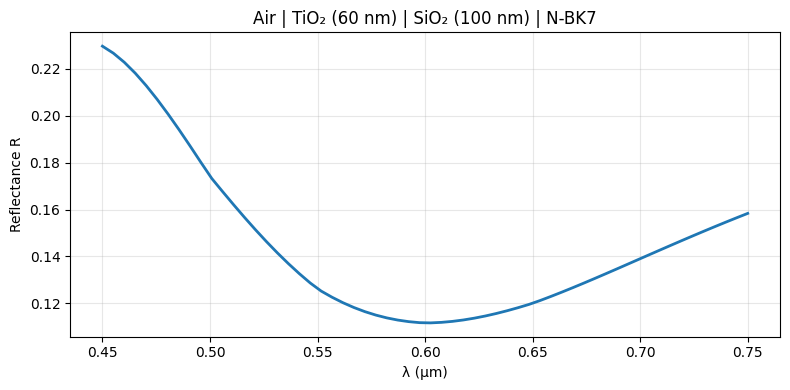
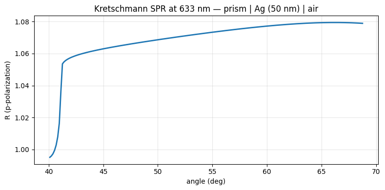

# Real Materials

Use wavelength-dependent refractive indices from DiffTMM's bundled catalogs
instead of constant numbers. The [`Material`](../api/material.md) class supplies
dispersive `n(λ)` and absorptive `k(λ)` data, looked up by name and passed
directly to any solver.

**Notebook:** `3_real_materials.ipynb`

## Inspect a material's dispersion

`Material(name).ior(wvln)` returns the complex refractive index at the given
wavelengths (μm) — real part `n`, imaginary part `k`:

```python
import torch
from difftmm import IsotropicFilmSolver, Material, list_materials

device = torch.device("cuda" if torch.cuda.is_available() else "cpu")
print(len(list_materials()), "known materials")

wvln = torch.linspace(0.40, 0.80, 100, device=device)
for name in ["SiO2", "TiO2", "Ag"]:
    n = Material(name, device=device).ior(wvln)   # complex tensor
    print(name, "n@550nm =", n[27].real.item(), "k@550nm =", n[27].imag.item())
```

`SiO₂` is a low-loss dielectric, `TiO₂` a high-index dielectric, and `Ag` a metal
with a large imaginary index in the visible.



## Anti-reflection coating

Pass material names straight into the solver — they're auto-wrapped in `Material`.
Here a two-layer TiO₂/SiO₂ AR coating on an N-BK7 substrate:

```python
solver = IsotropicFilmSolver(
    mat_in="air",
    mat_out="N-BK7",
    mat_ls=["TiO2", "SiO2"],
    thickness_ls=[0.06, 0.10],     # 60 nm / 100 nm
    device=device,
)

wvln  = torch.linspace(0.45, 0.75, 60, device=device)
theta = torch.tensor([0.0], device=device)            # normal incidence
ts, tp, rs, rp = solver.simulate(theta=theta, wvln=wvln)

R = (rs.abs() ** 2).squeeze()      # broadband reflectance
```



## Surface plasmon resonance

A metal layer in the Kretschmann configuration shows a sharp p-polarized
reflection dip as surface plasmons are excited — driven by silver's large
imaginary refractive index. Sweep the angle at 633 nm through a 50 nm silver film
on a glass prism:

```python
solver = IsotropicFilmSolver(
    mat_in=1.52,            # glass prism
    mat_out="air",
    mat_ls=["Ag"],
    thickness_ls=[0.05],     # 50 nm Ag
    device=device,
)

theta = torch.linspace(0.7, 1.2, 200, device=device)   # ~40-70 deg, radians
wvln  = torch.tensor([0.633], device=device)
_, _, _, rp = solver.simulate(theta=theta, wvln=wvln)

R_p = (rp.abs() ** 2).squeeze()    # reflection dip marks the plasmon resonance
```



This SPR calculation is one of the cases DiffTMM is validated against the
reference NumPy TMM library. See `3_real_materials.ipynb` for the full plots.
