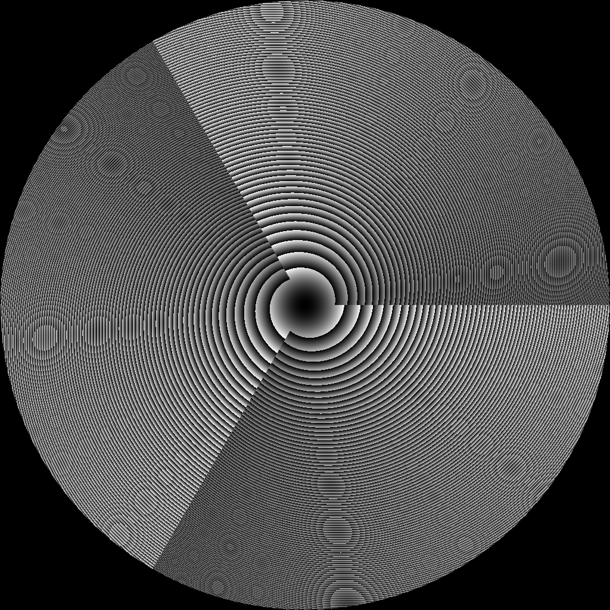
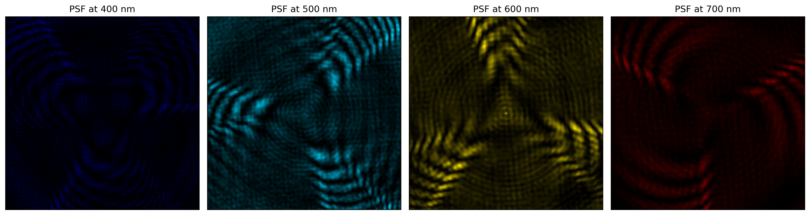
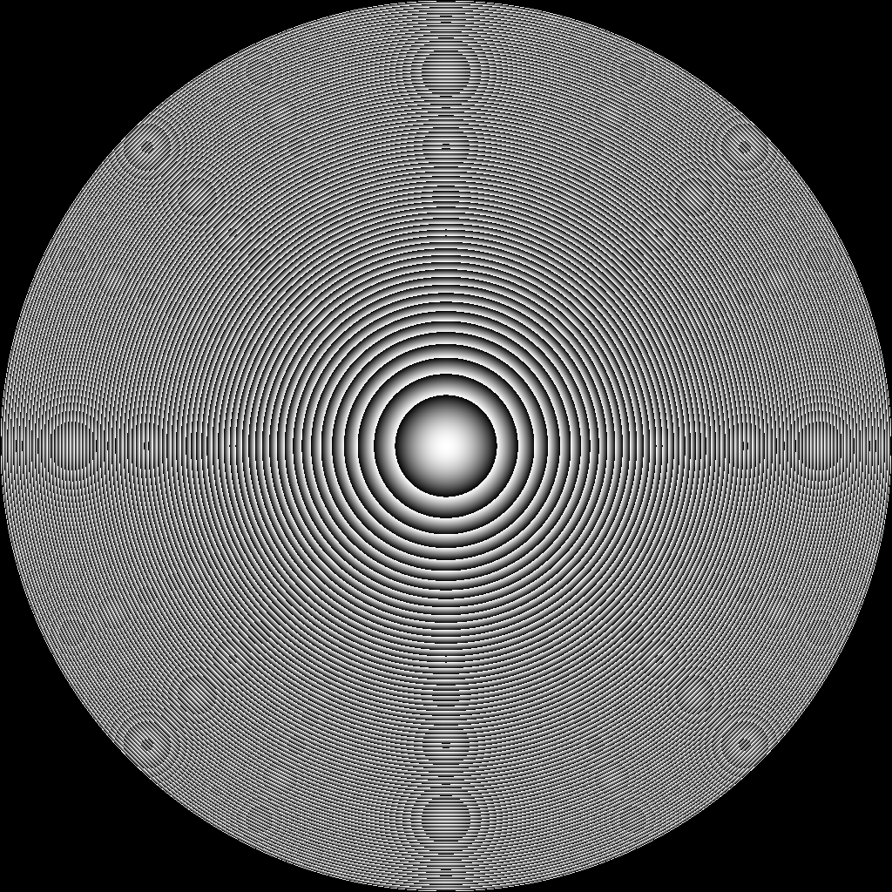
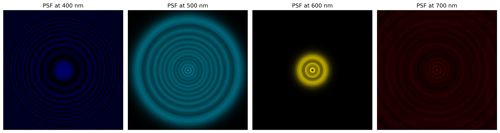

# Diffractive Surfaces

**Script:** `2_hsi_diffractive_surfaces.py`

The DOE is the optical encoder: its wavelength-dependent PSF is what carries spectral information into the RGB capture. DeepLens Hyperspectral ships three `DiffractiveSurface` parameterizations, each interchangeable through the lens-config JSON. This example renders each DOE's phase map and its PSF at 400, 500, 600 and 700 nm (point source at 1 m).

## Run

```bash
# Renders the DiffractedRotation and RotationallySymmetric encoders
python 2_hsi_diffractive_surfaces.py
```

## Key code

```python
from src.hsi_camera import HSICamera

for lens_file, tag in [
    ("./lenses/paraxiallens/doelens_diffracted_rotation.json",  "diffracted_rotation"),
    ("./lenses/paraxiallens/doelens_rotational_symmetric.json", "rotational_symmetric"),
]:
    cam = HSICamera(lens_file=lens_file, sensor_file="./sensors/flir/BFS-U3-200S7C-C.json")
    cam.vis_doe()                                                  # phase map (2D + 3D)
    cam.vis_psf(wvln_spectral=[0.4, 0.5, 0.6, 0.7], psf_ks=512, depth=-1000)
```

## Pixel2D — freeform

A free per-pixel height map (`doelens_hsi.json`). Every pixel is an independent learnable height, giving the most expressive — but highest-dimensional — encoder. This is the DOE built in [Hello DeepLens HSI](hello_hsi.md).

| Phase | Spectral PSF (400–700 nm) |
|---|---|
|  |  |

## DiffractedRotation (Jeon et al. 2019)

An analytic DOE built from blazed Fresnel sectors (here three, `num_wings: 3`). Its PSF is a sharp lobe that **rotates** to a different angle at each wavelength — an elegant, well-conditioned spectral code. It is fixed-form (its only continuous parameter is the focal length), so it is used as a *fixed* encoder, not an end-to-end design target.

| Phase | Spectral PSF (400–700 nm) |
|---|---|
|  |  |

## RotationallySymmetric (Dun et al. 2020)

A rotationally-symmetric achromat defined by a 1-D radial profile (initialized as a Fresnel lens). The PSF is a set of concentric rings whose scale shifts with wavelength. The radial profile is learnable, so this encoder *can* be designed end-to-end.

| Phase | Spectral PSF (400–700 nm) |
|---|---|
|  |  |

## Choosing an encoder

| DOE | Learnable | Use as |
|---|---|---|
| `Pixel2D` | full height map | freeform fixed encoder, or end-to-end design target |
| `DiffractedRotation` | focal length only | fixed analytic encoder |
| `RotationallySymmetric` | radial profile | achromat; end-to-end design target |

## Next steps

- [HSI Reconstruction](hsi_reconstruction.md) — train a network against a fixed encoder
- [End-to-End Design](end2end_hsi.md) — design the encoder jointly with the network
