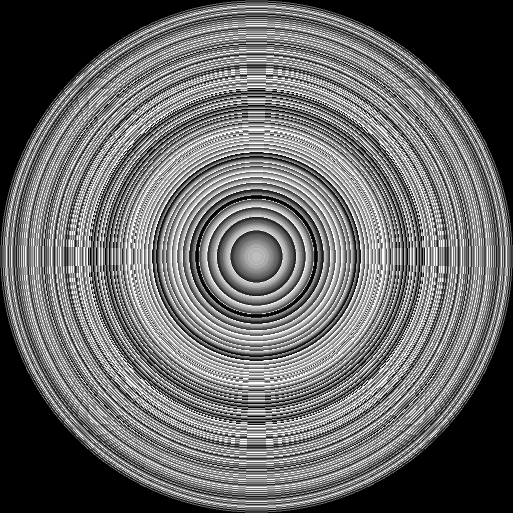
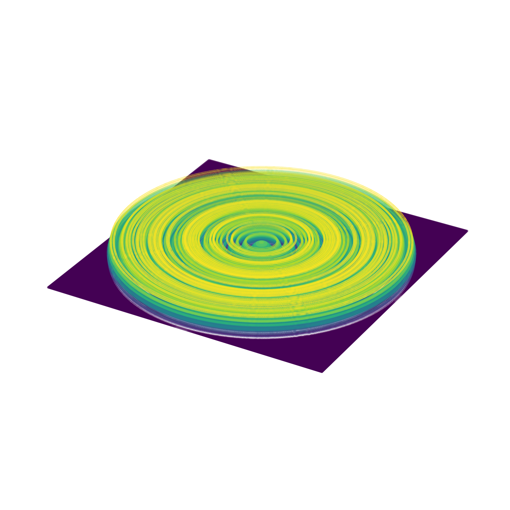
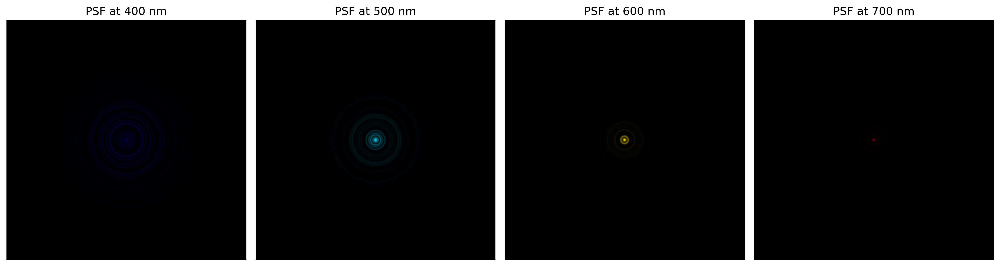

# Hello DeepLens HSI

**Script:** `0_hello_deeplens_hsi.py`

The warm-up example: build an `HSICamera` from a DOE lens file and a sensor file, then visualize the DOE and its spectral PSF. This confirms the wave-optics pipeline produces wavelength-dependent behavior — the basis of snapshot HSI.

## Run

```bash
python 0_hello_deeplens_hsi.py
```

## Code

```python
from src.hsi_camera import HSICamera

hsi_cam = HSICamera(
    lens_file="./lenses/paraxiallens/doelens_hsi.json",     # freeform Pixel2D DOE
    sensor_file="./sensors/flir/BFS-U3-200S7C-C.json",      # FLIR RGB sensor
)

hsi_cam.vis_doe()                                           # phase map (2D + 3D)
hsi_cam.vis_psf(wvln_spectral=[0.4, 0.5, 0.6, 0.7], depth=-1000)   # PSF at 400–700 nm, source at 1 m
```

`vis_doe()` draws the DOE's design-wavelength phase map (2D and 3D); `vis_psf()` renders the PSF at each listed wavelength (in µm) for a point source at `depth` mm (here 1 m).

## DOE phase map

The default lens (`doelens_hsi.json`) is a freeform `Pixel2D` DOE — a per-pixel height map (here provided by [Jingyue Ma](https://github.com/Jingyue-MA)) on a 1024×1024 grid with a 4 µm feature size and a 700 nm design wavelength.

| Phase map | 3D height |
|---|---|
|  |  |

## Spectral PSF

The PSF at 400, 500, 600 and 700 nm for a point source 1 m from the camera. The PSF scales and shifts with wavelength — that variation is the spectral signature the reconstruction network learns to invert.



## Next steps

- [Diffractive Surfaces](diffractive_surfaces.md) — compare all three DOE encoders
- [HSI Reconstruction](hsi_reconstruction.md) — train a network against this fixed DOE
